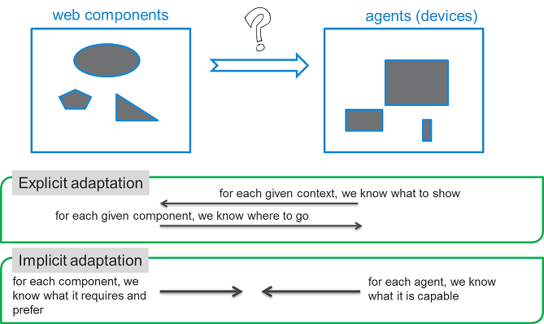
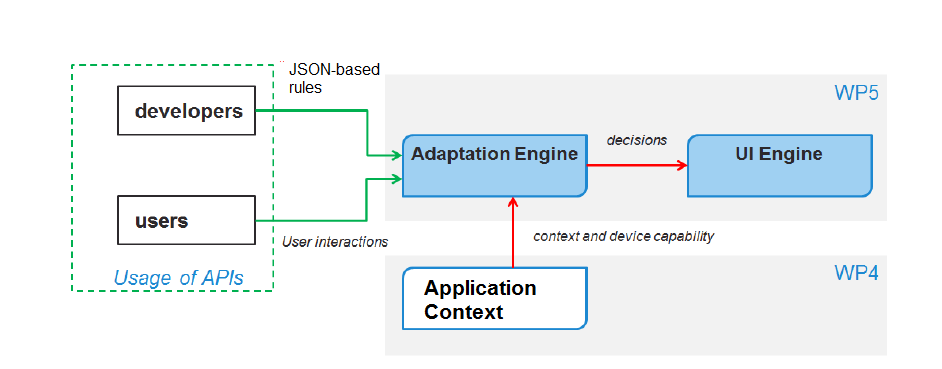
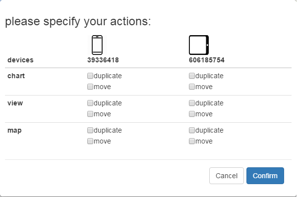

# Adaptation Engine

The major design of the adaptation engine and its APIs are introduced as follows. 

### Navigation
[Main Problem][] | [Hybrid Adaptation][] | [APIs][] | [Rule Types][]

### Main Problem
The multi-device adaptation engine is supposed to dynamically decide which part of application content goes to which device 
according to the current context and device capabilities.

Within the MediaScape project, application content has been abstracted as a set of web components that can be
distributed over multiple devices within a single application session. 
Meanwhile, the capabilities of all active devices have been shared across agents as the shared context, provided by the interface of Application Context. 
Therefore, the problem for Adaptation Engine can be formulated as a dynamic resource allocation problem. 
As illustrated by following figure, within a multidevice application session, 
given a set of web components and a set of active devices with different capabilities,
the adaptation engine needs to figure out how to allocate the web components to the active devices in a way
that the distribution of web components over devices can fit to the current context and be able to provide
seamless user experience.



### Hybrid Adaptation

In general, there are two different types of approaches to this main problem: explicit adaptation and implicit
adaptation. Explicit adaptation means that for each given context we know how to allocate each web component
to each device, while implicit adaptation means that for each web component which type of devices it requires or
prefers but we do not know which device it goes specifically. 

Both approaches have advantages and disadvantages. 
Explicit adaptation allows developers to specifically set up web components across all active
devices when the developers know how web components must be set for a given context. However, it is difficult,
or at least some big effort, for developers to list the allocations for all possible contexts, because the
combinations of all contexts and changes can be exponentially large. In contrast, implicit adaptation just needs
the developers to specify the requirements/preferences of all web components about what type of devices they
require and prefer. The allocation from web components to devices must be done by the adaptation engine.
Therefore, the effort required from the developers can be less. However, with implicit adaptation, it is no longer
easy to have any specific setup since which device a specific web component goes is up to the overall decision of
the Adaptation Engine. 

Therefore, a hybrid adaptation engine is designed and implemented to take advantages of both approaches. 
Beside that, a user preference based adaptation is also implemented to 
allow users to move/duplicate a web component from one device to another device according to their own preferences. 
The method to utilize different types of adaptations is to assign a priority to each adaptation. 
The hybrid adaptation will combine the outputs of different adaptations and generate the final decisions for the local UI engine. 

The following figure shows the framework of the adaptation engine, which follows the hybrid adaptation approach to
utilise ECA-rule based explicit adaptation, matching-based implicit adaptation, and user interaction based
personal adaptation. Each adaptation can be regarded as a plugin to the hybrid adaptation.


### APIs

The following picture shows the relationship between the Adaptation Engine and the other MediaScape modules in the
project and also the interfaces of the adaptation engine to both users and developers. The Adaptation Engine can
get inputs from the following aspects: 

1. It accesses the latest context (e.g., how many devices in the current
application sessions and the capabilities of each active device) from the interface of the SharedContext module
that has been developed in WP4; 
2. It provides the interface to developers to specify rules for explicit adaptation
or CSS properties for implicit adaptation; 
3. It also shows up some interactive user interface to allow users to
choose where to move/mirror a selected web component. On the other hand, the adaptation engine outputs its
decisions on which web component should be presented on which device to the UI engine. 



#### Interfaces to developers

A rule file is used by web developers to specify the adaptation behavior for their applications and this rule file must be placed into the root folder of the applications. 

JSON is selected to define adaptation rules since it is well known to web developers and also simply and flexible to express different types of rules. 
More important, JSON is supported by all browsers natively and no additional library is needed to parse the rule text. 

The entire JSON rule file include three main sections, for explicit adaptation, implicit adaptation, and user preference based adaptation respectively.
For implicit adaptation, different types of rules can be further defined regarding that different algorithms can be proposed 
to match web components to devices based on different requirements. At the moment, we already implemented a matching algorithm based on the affinity score
between the requirements of web components and the capabilities of devices. A "bestfit" algorithm will be provided by VIC soon. 

```js
{
    "name": "Multi-device adaptation behaviour descriptor for the multi-device adaptation engine",
    "explicitRules":  {rule object},
    "implicitRules": {
        "bestfit": {rule object},
        "affinitymatch": {rule object}
    },
    "userPreferences": {rule object}
}
```

Each rule object includes the following five types of information: 

* **name**: a unique name for the plugin;
* **enabled**: tell the adaptation engine to enabled it or disable it;
* **capability**: to explicitly specify what are the agent capabilities needed for this adaptation plugin; this is for the adaptation engine to know what are the agent capabilities to subscribe
* **priority**: the priority to be considered by the hybrid adaptation engine when merging decisions from multiple adaptation plugins;
* **behavior**: how to adapt, to specify the detailed adaptation behavior

#### Interfaces to users

A modal dialog is designed to allow users to select which web component they like to
move/duplicate and also the destination device. 
This dialog is triggered when the user clicks the fixed multi-device behavior button, which is injected by the Adaptation Engine into the web application. 
The modal dialog is shown as the following figure. 




#### Interfaces to UI engine

In order to receive the decisions, the UI engine just needs to register a callback function to the "actionchange" event as below. 

```js
    // applyActions is a callback function provided by the UI engine to perform the decisions 
    mediascape.AdaptationToolkit.Adaptation.multiDeviceAdaptation.on('actionchange', applyActions); 
```    


### Rule Types

At the moment, we support 3 different types of rules. Their main difference is how to specify their adapatation behavior. 
For each of them, an exmaple is provided to show how they should be defined as below. 
Assume that there are three web components (chat, view, map are their IDs) in the application. 

* Explicit rules

For the specification of the adaptation behavior, the "agents" part lists all possible agents with different capabilities
and then the "rules"" part lists a set of specific conditions and their assocated actions to do under those conditions. 
For the actions, we have to explicitly define which agent is going to show which components. 

```js
"explicitRules": {
        "name": "explicit",
        "enabled": true,		
        "priority": 2,
        "capabilities": ["deviceType"],
        "behaviour": {
            "agents": {
                "agent1": {
                    "deviceType": "computer"
                },
                "agent2": {
                    "deviceType": "tablet"
                },
                "agent3": {
                    "deviceType": "mobile"
                },
                "agent4": {
                    "deviceType": "tv"
                }                                
            },
            "rules": [
                {
                    "conditions": {
                        "exists": [
                            "agent1"
                        ]
                    },
                    "actions": {
                        "agent1": {
                            "chart": {
                                "load": true
                            },
                            "view": {
                                "load": false,
                                "volume": 1
                            },
                            "map": {
                                "load": false
                            }
                        }
                    }
                },
                ... 
            ]
        }
    },
```

* Implicit rules

There could be different types of implicit rules. Here is the one we already implemented, called affinitymatch. 
In the behavior specification, the developer needs to difine the required and prefered device capabilities for each component. 
Then the adaptation engine will calculate the best matching automatically. 
In the preference part, an affinity score is defined for each prefered device capability. 

```js
        "affinitymatch": {
            "name": "affinitymatch",
            "enabled": false,			
            "priority": 4,
            "capabilities": ["platform","onLine"],
            "behaviour": [
                {
                    "componentId": "chart",
                    "requirement": "platform(Win32)",
                    "preference": "onLine(high, 2)"
                },
                {
                    "componentId": "view",
                    "requirement": "platform(linux)",
                    "preference": "onLine(high, 1)"
                },
                {
                    "componentId": "map",
                    "requirement": "platform(android)",
                    "preference": "onLine(high, 1)"
                }
            ]
        }
```

* User preference rules

For user preference based adaptation, the developers just have to define which components can be duplicated or moved from one device to another device
in the rule file. The rest is done by users via a pop up dialog. 

```js
    "userPreferences": {
        "name": "userpref",
        "enabled": true,		
        "priority": 1,
        "capabilities": ["deviceType", "operation"],		
        "behaviour": [
            {
                "componentId": "chart",
                "movable": true,
                "duplicable": false
            },
            {
                "componentId": "view",
                "movable": true,
                "duplicable": false
            },
            {
                "componentId": "map",
                "movable": true,
                "duplicable": true
            }
        ]
    }
```


[Main Problem]: #main-problem
[Hybrid Adaptation]: #hybrid-adaptation
[Rule Types]: #rule-types
[APIs]: #APIs


